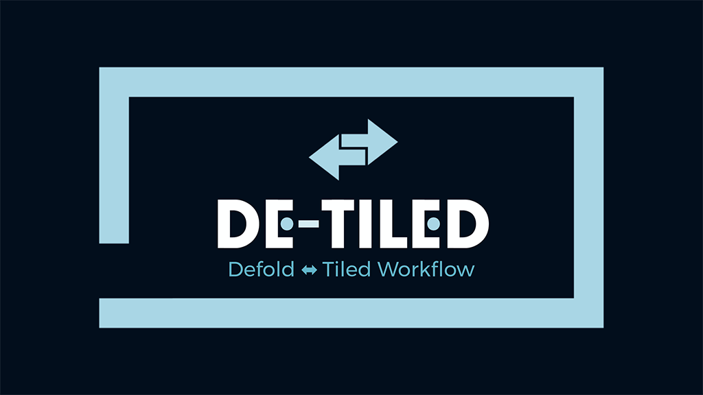

**Detiled Workflow** - bunch of tools to make work with Defold and Tiler easier.
Tiled Generator can do next stuff:

- Generate Tiled tilesets from Defold assets folder
- Generade Defold factories and collections from Tiled map and tilesets
- Generate mapping - list of all usable entities

## Setup

Detiled contains two modules: npm module for export work and Defold library to additional work with generated assets and Maps/Tilesets jsons

Install Detiled module:
`npm install -g detiled`

## Usage

### Generate tilesets

`detiled generate_tilesets [defold_assets_folder_path] [output_folder_path]`
	-- Export assets from Defold asset folder to Tiled's tilesets

`detiled export [tilesets_folder_path] [maps_folder_path] [output_folder_path]`
	-- Generate Defold collections and other assets from Tiled's maps and tilesets

### Generate Defold stuff

`node index.js {folder_with_tilesets.json} {folder_with_maps.json} {output_folder}`

Tilesets and maps should be exported from Tiled as json
or with command:

`tiled --export-tileset tileset.tsx tileset.json`
`tiled --export-map map.tmx map.json`

Generator will create spawners (go with factories) for every tileset
Generator will create map_spawner collection with only used spawners in this map for every map

### Mapping

## License

Developed by [Insality](https://github.com/Insality)

**MIT** License

## TODO Docs
- Tiled Enviroment path
- map spawners, how they generated
- assets generating flow
- defold resources generating flow
- groups
- z layering
- custom/additional tiled propeties for export
- scaling/rotate go/collection
- multiply images with single go/collection
- go/collection properties
- autofill properties

## Issues and suggestions

If you have any issues, questions or suggestions please [create an issue](https://github.com/Insality/defold-tiled-generator/issues) or contact me: [insality@gmail.com](mailto:insality@gmail.com)

## ISSUES
No exporter found for target file. - add .collection exported in tiled
